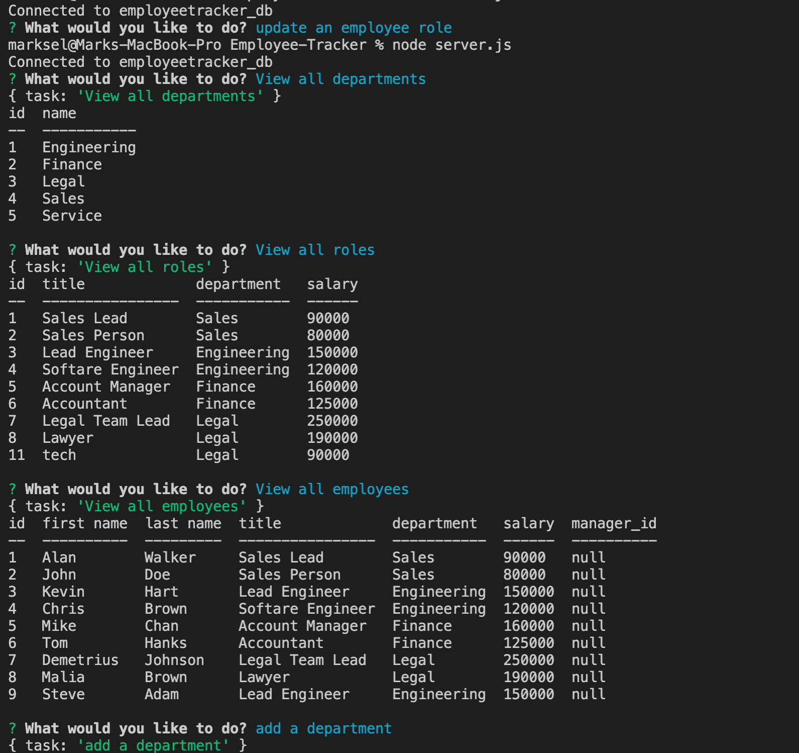

# Employee-Tracker

  

  ## Description

  This application allows a user to store departments, roles and employees in a database. The user can also add departments, roles, employees, and update an employees role. The application uses packages such as inquirer, console.table, and mysql2.

  ## Table of Contents

  * [Installation](#installation)

  * [Usage](#usage)

  * [License](#license)

  * [Contributing](#contributing)

  * [Tests](#tests)

  * [Questions](#questions)

  ## Installations 

  Run npm i in the command line to be able to install necessary dependencies.

  ## Usage

    1. Make sure to install all dependencies by running npm i in the terminal after cloning the repository
    2. In the terminal run node server.js to start the application.
    3. Select whatever you would like to do and answer all prompts.

  
  

  ## License 

  MIT

  ## Contributing Guidelines 

  Do not contribute to this repository.

  ## Tests

  npm run test

  ## Video Link
  
  https://watch.screencastify.com/v/ZdqcQh7iY6AtID7xEot2

  ## Questions 

  For more information about me checkout my github at https://github.com/marksely. For any questions regarding this repository or how to use this generator please email me at mark.sel9@gmail.com.
